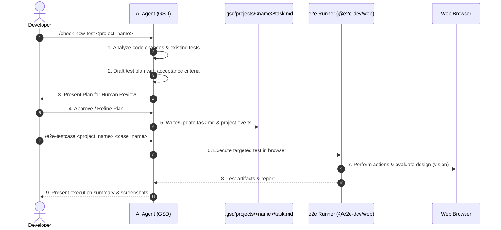

# .gsd E2E Testing Workflow Lifecycle

This document describes the operational lifecycle for discovering, planning, reviewing, generating, and running e2e test cases.



---

## Command 1: `/check-new-test <project_name>`

### Purpose
Scans code modules and recent changes to detect new test cases or coverage gaps, plans the test scenarios, and halts for human review before generating code.

### Execution Steps
1. **Analyze:**
   - Read `.gsd/RULES.md`.
   - Inspect `.gsd/projects/<project_name>/task.md` (if it exists) to list existing coverage.
   - Inspect the target application code, recent git diffs, components, and routes.
   - Identify missing user scenarios, edge cases, and visual design requirements.
2. **Plan:**
   - Formulate proposed test cases in standard GSD format (`[TC-xx]`).
   - Define exact preconditions, execution steps, functional assertions, and visual/design checks.
3. **Human Review Gate:**
   - Present the plan to the human reviewer in Markdown with structured tables and checkboxes.
   - **Do NOT generate `.e2e.ts` code until the reviewer confirms or provides adjustments.**
4. **Generate / Update:**
   - Once approved, update `.gsd/projects/<project_name>/task.md`.
   - Generate or update `.gsd/projects/<project_name>/<project_name>.e2e.ts`.

---

## Command 2: `/e2e-testcase <project_name> <case_name>`

### Purpose
Runs a specific test case in isolation against the browser interface, verifying both functionality and visual design.

### Execution Steps
1. **Context Loading:**
   - Read `.gsd/projects/<project_name>/task.md` to load the specification for `<case_name>`.
   - Locate the matching test in `.gsd/projects/<project_name>/<project_name>.e2e.ts`.
2. **Precondition Setup:**
   - Check if `<case_name>` specifies a required session (e.g. `session:auth`) or seed state.
   - Ensure the dev server is active (via `e2e.config.ts` or `app.command`).
3. **Execution:**
   - Run the targeted test:
     ```bash
     pnpm exec e2e run .gsd/projects/<project_name>/<project_name>.e2e.ts -t "<case_name>" --headed
     ```
4. **Verification & Report:**
   - Check output status: passed, failed, or blocked.
   - Inspect screenshot evidence in `.e2e/artifacts/`.
   - Report concise results, including design assessment and functional verdicts.
