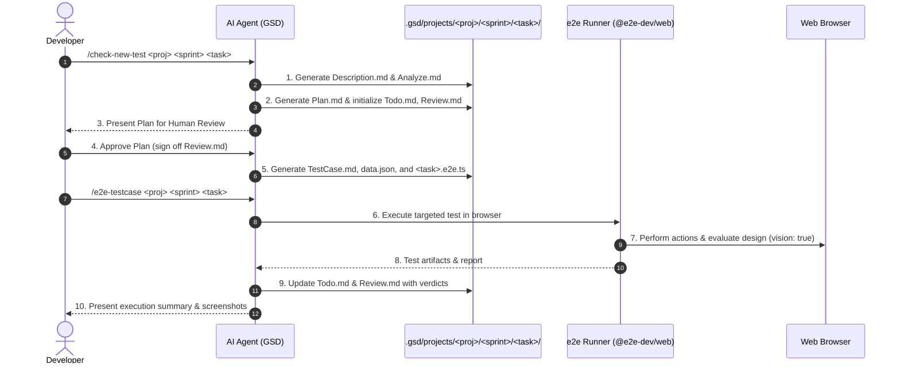

# .gsd E2E Testing Workflow Lifecycle

This document describes the Agile operational lifecycle for discovering, planning, reviewing, generating, and running e2e test cases organized by **Projects**, **Sprints**, and **Tasks**.



---

## Command 1: `/check-new-test <project> [sprint] [task]`

### Purpose
Analyzes application features and code changes, creates or updates the task directory structure, generates `Description.md`, `Analyze.md`, and `Plan.md`, and halts for human review before generating test code.

### Execution Protocol
1. **Analyze:**
   - Read `.gsd/RULES.md`.
   - Inspect the codebase (routes, components, git diff).
   - Create or locate `.gsd/projects/<project>/<sprint>/<task>/`.
   - Write `Description.md` (overview & criteria) and `Analyze.md` (DOM/preconditions analysis).
2. **Plan:**
   - Write `Plan.md` outlining the test strategy and assertions.
   - Initialize `Todo.md` checklist and `Review.md` with status `PENDING_REVIEW`.
3. **Human Review Gate (MANDATORY):**
   - Present the plan to the human reviewer in Markdown.
   - **Do NOT generate `.e2e.ts` code until the reviewer signs off in `Review.md` or chat.**
4. **Generate & Sync (Post-Approval):**
   - Write `TestCase.md` and `data.json`.
   - Generate the runnable `<task>.e2e.ts`.
   - Mark review as `APPROVED` in `Review.md`.

---

## Command 2: `/e2e-testcase <project> <sprint> <task>`

### Purpose
Executes a specific task's test case in isolation against the live browser interface, verifying functionality and visual design, and logging execution verdicts.

### Execution Protocol
1. **Context Loading:**
   - Read `.gsd/projects/<project>/<sprint>/<task>/TestCase.md` and `Plan.md`.
   - Locate the runnable test file `.gsd/projects/<project>/<sprint>/<task>/*.e2e.ts`.
2. **Execution:**
   - Run the targeted test:
     ```bash
     pnpm exec e2e run .gsd/projects/<project>/<sprint>/<task>/*.e2e.ts --headed
     ```
3. **Verdict & Artifact Update:**
   - Check status (`passed`, `failed`, or `blocked`).
   - Update `Review.md` with the execution date, status, and screenshot paths.
   - Update `Todo.md` checking off execution items.
   - Report the summary with clickable links to captured screenshots and logs.

---

## Running Sprints & Suites via CLI

In addition to slash commands, you can run tests at any granularity:

* **Run a single task:**
  ```bash
  pnpm exec e2e run .gsd/projects/greeting-app/sprint-greeting/task-greet-valid/greet.e2e.ts --headed
  ```
* **Run an entire sprint:**
  ```bash
  pnpm exec e2e run ".gsd/projects/greeting-app/sprint-greeting/**/*.e2e.ts"
  ```
* **Run all projects & sprints:**
  ```bash
  pnpm exec e2e run ".gsd/projects/**/*.e2e.ts"
  ```
